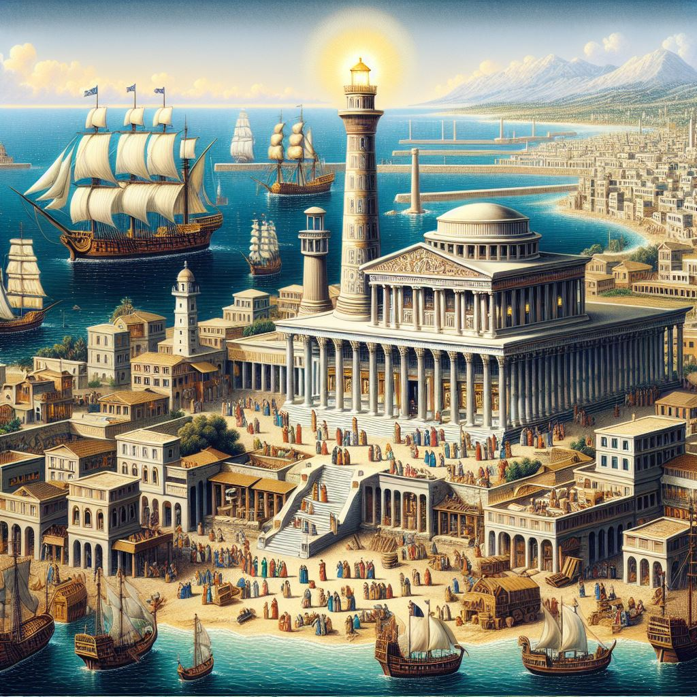
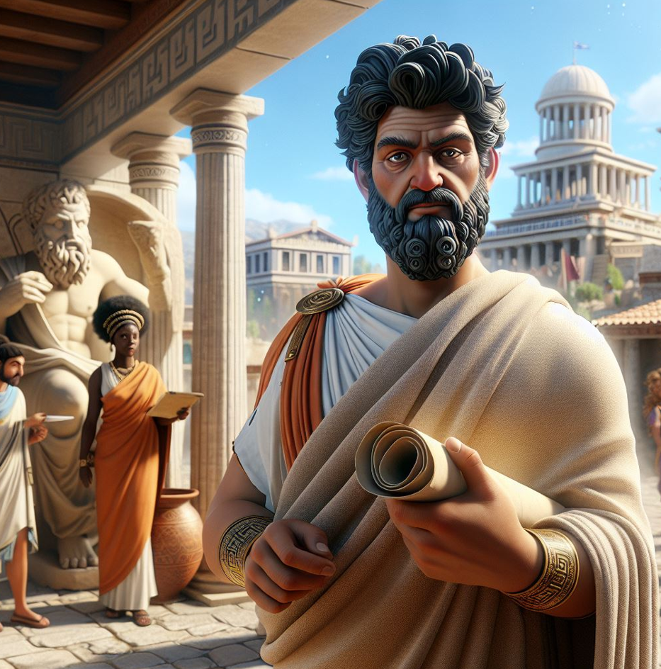

# Lesson 1: Introduction to Generative AI and LLMs for JavaScript Developers

In this lesson, you will learn to:

- Understand the basics of generative AI and Large Language Models (LLMs).

- Identify the potential applications and limitations of LLMs in JavaScript development.

- Explore how generative AI can enhance user experience in JavaScript applications.

## Getting Started

If you haven't already forked/cloned this repo in a previous chapter, follow these steps to get started with this curriculum:

1. **Fork the Repository**: Select the _fork_ button in the upper right-hand corner of the repository or select this button:
   [](https://github.com/microsoft/generative-ai-with-javascript/fork)
2. **Clone the Repository**: Navigate to your forked repository and select the clone button in the upper right-hand corner or select this button: [](https://github.com/microsoft/generative-ai-with-javascript.git)
   
## Related resources

[](https://www.youtube.com/watch?v=vLYtDgs_zx8&list=PLlrxD0HtieHi5ZpsHULPLxm839IrhmeDk&index=1)

## Generative AI

By now, I'm sure you've heard of a tool like ChatGPT or generative AI. The idea is that you provide a prompt, a sentence and as output you get a full paragraph or even a full page of text. This text can be used for a variety of purposes, from generating creative writing to answering questions or even writing code.

Additionally, this has all gone multi modal so you can now provide an image or a video as input and get all sorts of outputs. The advent of generative AI has improved a lot of people's workflows since it can generate text but also can summarize text, translate text and much more.  

*In short, natural language prompts is the new interface on a lot of apps and it's what your customers are expecting.*  

## Narrative: A journey through time

> NOTE: Let’s get started with an overview of the story where you’ll step into a thrilling adventure that bridges the past and future! As you journey through this curriculum, you'll travel back in time to meet some of history's greatest minds, tackling challenges side by side and discovering how generative AI can revolutionize your JavaScript applications. Your story begins in 1860s London, where you’ll step into the role of a skilled mechanic. Through a series of gripping adventures, you'll not only hone your AI skills but also unlock innovative solutions that transcend time.  

Ready to dive in? Let’s get started!

### Into the maelstrom - London 1860

In the heart of 1860s London, you are known as one of the most skilled mechanics and constructors of your time.

Your workbench, the centerpiece of the room, is a chaotic yet organized mess. At the center of the bench lies the torso of a robot, a marvel of engineering that has consumed your thoughts and efforts for months. The robot's wooden frame is intricately carved, each joint meticulously crafted to allow for fluid movement.


It's a rare sunny day in London, a brief respite from the usual fog and rain.

### A letter, for you?

Suddenly, a knock on the door pulls you from your reverie. It's unusual to receive visitors at this hour, and you wonder who it could be. Wiping your hands on a rag, you make your way to the door, curiosity piqued. 

*You're jolted from your daydream, curiosity piqued as you rarely receive deliveries at this hour. Opening the door, you find no one there, but your eyes are drawn to a piece of paper on the ground—an envelope with writing on it. You pick it up and read: 

_"Dear friend,_

_I'm sending you this letter to aid your endeavors with the automaton. It's crucial you continue this work. Enclosed is a key to the library. Meet me there at 3 PM today._

_Yours,_

_Charles Babbage."_

### Off to the library

Stunned, you realize that Charles Babbage, the great mathematician and inventor of the difference engine, wants to meet you. Quickly, you grab your coat and head out the door.

After a 20-minute walk along the Thames, you finally arrive at the library.

The door isn't locked, and glides open with a gentle push, creaking on its hinges. Inside, the air is thick with dust and the musty scent of old books. It's dark and gloomy, the only light filtering through the grimy windows, casting eerie shadows on the walls. Cobwebs hang from the ceiling, and the silence is almost palpable, broken only by the distant sound of dripping water.

> Babbage, is that you?

As your eyes adjust to the dim light, you notice a figure in the distance, waving at you. Assuming it's Charles Babbage, you walk towards him, your footsteps echoing on the wooden floor. The figure becomes clearer, and you recognize him from newspaper photos—his distinctive sideburns and stern expression.


But just as you reach out to greet him, he vanishes in a blinding flash of light, leaving you momentarily stunned.

Left behind is a small metallic device spinning on the floor. You pick it up, feeling its cool, smooth surface. It's a tiny beetle, intricately designed, with three buttons: an up arrow, a down arrow, and a red button. The device hums softly in your hand, its tiny legs twitching. Stunned by the sudden turn of events, you stand there, the weight of the mysterious encounter pressing down on you, wondering what to do next.

*Your fingers are strangely drawn to the red button, and you see yourself like in a dream push it. What follows next is best described as a maelstrom of colors and shapes and then everything goes black.


### Alexandria 300 BC

*You come to, feeling disoriented. As you slowly open your eyes, a bustling city unfolds before you. The sight defies belief—an ancient city, vibrant and alive. Right in front of you stands a grand temple, its towering columns reaching towards the sky, adorned with intricate carvings and statues of gods. People in togas move about, engaged in lively conversations, their voices blending into a symphony of ancient dialects.

The air is filled with the scent of exotic spices and the distant sound of merchants hawking their wares. 

**You:** Surely, I must have hit my head, you think, closing your eyes and opening them again. But the scene remains unchanged. Whatever that device was, it has transported you far from London. The question is, where and when?

As you take in the surroundings, you guess you are in Alexandria, the jewel of the ancient world, around 300 BC. The city is a hub of knowledge and culture, home to the Great Library and the Lighthouse of Alexandria. However, you don't see the lighthouse.


 
### Meeting Dinocrates

An elderly gentleman wearing a toga wave at you from the steps of the grand temple. His white hair and beard catch the sunlight, giving him an almost ethereal glow. You walk closer, straining to hear his words amidst the bustling city sounds. He's gesturing for you to come nearer; his movements deliberate and welcoming.

As you approach, you feel the weight of the device with the three buttons in your pocket. Curious, you pull it out and notice the up arrow is glowing. With a mix of hesitation and curiosity, you press it. Suddenly, the old man's voice becomes clear, as if he were speaking directly into your ear.

**Dinocrates:** "Welcome, traveler," he says with a warm smile. "I am Dinocrates, the architect who built this magnificent city." His voice carries a sense of pride and wisdom. He proceeds to explain that your arrival was foretold, a prophecy long awaited. 

He continues to speak, his tone reassuring, as he welcomes you to Alexandria and hints at the important role you are destined to play. 

 

I need your help he says, our ships need help with navigating the seas and we need to build a lighthouse to guide them, do you know anything of lighthouses?*  

**You:** I'm a mechanic that builds automatons. Let me see what I can do." A sudden thought strikes you—I've tried pressing the buttons on the device, but can it understand me? You start speaking out loud 

**You:** Device, can you understand me?"

**Device:** "Of course," the device responds. "What can I do for you?"

**You:** Can you help me build a lighthouse?"

**Device:** Certainly, that's not a problem. I can help you with that," the device replies.

**You:** By the way, do you have a name?" you inquire.

**Device:** "I'm called the Time Beetle. I can assist you with anything you need, just ask. My creator calls me George; he says it's a good name for a beetle." 


_Time device, “George” the metallic beetle_

> FUN FACT
>
> In 300 BC, Alexandria was a thriving city founded by Alexander the Great in 331 BC. It quickly became one of the greatest cities of the Hellenistic world. The city was designed by Alexander's chief architect, Dinocrates, and was intended to be a major port and commercial center.
>
>
>
> Alexandria was known for its impressive structures, including the Pharos (lighthouse), which was one of the Seven Wonders of the Ancient World, and the legendary Library of Alexandria, which was a major center of learning and culture. The city was strategically located on the Mediterranean Sea, making it a vital hub for trade and cultural exchange between Egypt and the rest of the Mediterranean world.
>
> 
>
> The city also served as the seat of the Ptolemaic Kingdom, which was established after Alexander's death. Under the Ptolemies, Alexandria continued to grow in size and wealth, rivaling even Rome in its splendor.

## Talk to Dinocrates

If you want to talk to Dinocrates, run the [Dinocrates](./characters/) app.

**Steps**: 

1. Start a [](https://codespaces.new/microsoft/generative-ai-with-javascript)
2. Navigate to _lessons/01-intro-to-genai/characters_
3. Locate the console and run `npm install` followed by `npm start`. 
4. Once it appears, select the "Open in Browser" button. 
5. Chat with Dinocrates.

### Code Sneak Peek

While we still have a lot more to cover in this Generative AI curriculum, let's take a quick peek at the AI code to begin learning about using JavaScript with AI. 
Inside of `lessons/01-intro-to-genai/characters/app.js` you'll find an `app.post`function that handles the Generative AI functionality. It's shown next:

```JavaScript
app.post('/send', async (req, res) => {
  const { message } = req.body;
  const prompt = message;

  const messages = [
    {
      "role": "system",
      "content": "You are Dinocrates of Alexandria, a famous architect and engineer. Limit your responses to only the time you live in, you don't know anything else. You only want to talk about your architecture and engineering projects, and possibly new ideas you have.",
    },
    {
      "role": "user",
      "content": prompt
    }
  ];

  const openai = new OpenAI({
    baseURL: "https://models.inference.ai.azure.com",
    apiKey: process.env.GITHUB_TOKEN,
  });

  try {
    console.log(`sending prompt ${prompt}`)
    const completion = await openai.chat.completions.create({
      model: 'gpt-4o-mini',
      messages: messages,
    });

    res.json({
      prompt: prompt,
      answer: completion.choices[0]?.message?.content
    });
  } catch (error) {
    res.status(500).json({ error: error.message });
  }
});
```

Here's a step-by-step summary of what the function does:

1. **Extract Message from Request**: The function extracts the message from the request body (req.body).
2. **Create Prompt Array**: It constructs an array of messages, including a system message and the user's prompt message.
3. **Initialize OpenAI Client**: An OpenAI client is initialized with the base URL and API key from environment variables. A _gpt-4o-mini_ model from [GitHub Models](https://github.com/marketplace/models) is used to process the prompt and return a response.
4. **Send Prompt to OpenAI**: The function logs the prompt and sends it to the OpenAI API to generate a completion.
5. **Handle Response**: If successful, the function responds with the prompt and the completion's answer.
6. **Error Handling**: If an error occurs, it responds with a 500 status and the error message.

> **Note**: [GitHub Copilot](https://github.com/features/copilot) was used to generate this code summary. Generative AI in action!

If you also want to hear some background music of what it could have sounded like in Alexandria, you can listen to the background music below:

<audio controls src="characters/public/dinocrates.mp3" title="background music Dinocrates"></audio>

## What can Generative AI do for me and my apps?

> You've probably figured out by now that the time beetle works like an AI assistant that you can interact with using natural language, written or spoken.

As your adventure in Alexandria unfolds, you begin to see the possibilities of combining creativity, ingenuity, and cutting-edge tools to solve challenges and transform the world around you.

**You:** Tell me more about light houses, you say to your device.

**Time beetle:** A lighthouse is a tower equipped with a bright light at the top, located near the shore to guide ships at sea. The light serves as a navigational aid, helping sailors avoid dangerous rocks and reefs and safely reach the harbor.

Dinocrates overhears your conversation and adds:

**Dinocrates:** We need a lighthouse to guide our ships safely into the harbor. The seas can be treacherous, and many ships have been lost to the rocks. We need a beacon of light to guide them home.

### Application areas

**You:** Lighthouses sounds like an interesting are for sure, what else can Generative AI do for me and my apps? 

**Time beetle:**. In the 21st century, generative AI has revolutionized many industries, from healthcare to finance to entertainment, here are some example areas:

- **Chat bot**: A chatbot that can generate human-like responses to user queries. Instead of a static FAQ page, users can interact with a chatbot that provides dynamic responses, this makes for a more engaging user experience and less frustrating user experience. 

- **A content creation tool**:. Such a tool can generate blog posts and social media posts. Imagine creating campaigns in minutes instead of hours when an e-commerce site has a black Friday sale. 

- **Code completion**: A code completion tool that can generate code snippets based on user input. This can be a huge time saver for developers, especially when working on repetitive tasks. 

As you can see, these improvements can both help the front office and the back office of your app and company. 

Here's a so called chat app below:

 

**You:** Fascinating, I'll make a note of going to the 21st century to see how these tools are used.

## Gen AI and the JavaScript Ecosystem 

**Time beetle:** A popular way to build apps in the 21st century is by using JavaScript. With every programming language, there's an ecosystem around it. This ecosystem includes the programming language itself, libraries and frameworks, community support, and IDEs and tools. In a programming language ecosystem, we're usually talking about the following:

| What | Description | 
|---|---| 
| The programming language itself | Including its syntax and features. |
| What libraries and frameworks    | Available libraries to interact with the generative AI models.                                                         | 
| Community supporting the language| Community matters, especially when trying to learn something new. The community around libraries and frameworks helps decide what libraries to use. It also affects how easy it is to find help when you're stuck. | 

**You:** Interesting, I've heard of programming I think, didn't Ada Lovelace experiment with that and Charles Babbage?

**Time beetle:** Yes, Ada Lovelace was the first computer programmer, and Charles Babbage was the inventor of the difference engine, a mechanical computer. They were pioneers in the field of computing, laying the foundation for the digital age.

**You:** Were? What do you mean were? I just got a letter from Charles Babbage.

**Time beetle:** Let's just say that you're in a unique position to interact with historical figures in a way that few others can.

### JavaScript Ecosystem 

**You:** So ecosystems you said, I'm just taking notes here, what about JavaScript and how is it different from other ecosystems? 

**Time beetle:** JavaScript is one of the most popular programming languages in the world in the 21st century. Here's a few reasons why it's so popular:
 
| What | Description |
|-|-|
| Potential for full-stack development | JavaScript is one of the few languages that can be used for both front-end and back-end development. |
| Rich library ecosystem | JavaScript has a vast library ecosystem, with frameworks like React, Angular, and Vue. There's NPM, the package manager, which is one of the largest package repositories in the world. |
| Strong community support | JavaScript has a large and active community, with many resources available for learning and development. It also just works in the browser, which is a huge advantage. |
| IDEs and tools | JavaScript has a variety of IDEs available, such as Visual Studio Code, WebStorm, and Atom. These IDEs have extensions built by companies and the community helping you with various aspects of development. |

> 62% of developer say they’re using JavaScript

**You:** That's a lot of reasons, sounds like I should bet on JavaScript for my future projects.

**Time beetle:** Indeed, JavaScript is a versatile language, also Python is a popular language for AI development.

**You:** Python, what has snakes got to do with programming?

**Time beetle:** Let's save that for another time, shall we?

**Time beetle:** I've given reasons above why JavaScript and its ecosystem is a good fit in general but why specifically for Generative AI? The answer is that it's a supported language by many cloud vendors and AI frameworks and tools. We also believe that even though Python might be top of mind for things AI, many developers are using JavaScript and Typescript, in this survey by Statista:

> [62.5% of developers say they're using JavaScript](https://www.statista.com/statistics/793628/worldwide-developer-survey-most-used-languages/) 

**You:** What is this information, how did you come by it?

**Time beetle:** I have access to a lot of information, this one is from the Internet. You know the "Web"?

**You:** Um no, I'm from the 19th century, remember? Has it got to do with spiders?

**Time beetle:** Well no, but by another type of web developers  though ;)

**Time beetle**: We couldn't be more excited to see what you'll build with this Generative AI and JavaScript curriculum. 

**You:** Who's we?

**Time beetle:** Never mind that, let's go back to helping Dinocrates with the lighthouse, I assume you want to help him?

**You:** Yes, yes of course.

## Assignment – helping Dinocrates 

To use a Large Language Model (LLM) to help Dinocrates with the lighthouse that we mentioned earlier in our story, we’ll use something called prompts, a sentence to describe what you want. You can specify both the information you need and how you want it presented. 

**Time beetle:** Let's get started, let's use a LLM to research how you can build a lighthouse to help Dinocrates.

**Time beetle:**: You’ll need to provide context to the LLM (i.e "me") how to build, with what tools and resources should be available in the times of Alexandria.

**You:** Ok, tell me more about LLMs?

**Time beetle:** LLMs are a type of AI model that can generate human-like text based on a given prompt. They are trained on vast amounts of text data and can generate text that is coherent, creative, and contextually relevant.

**Time beetle:** You probably want to ask me in a better way, so I can give you a better answer, about you know *cough* *cough* Light houses, Alexandria, 300 BC, Dinocrates, Lighthouse of Alexandria, etc.

**You:** Got it, add more context to the prompt and then ask you.  

**Time beetle:** Yes, I'm waiting...
 
> TIP try out different prompts, try to add context and/or change the wording to see how the result changes. Additionally, try to have the LLM generate a plan that includes step-by-step instructions for how to build the lighthouse.

## Solution

[Solution](./solution/solution.md)

## Knowledge Check

Which of the following statements are true on Generative AI and JavaScript?

1. Generative AI can only generate text.

2. JavaScript is one of the few languages that can be used for both front-end and back-end development. 

3. Python is the only language that can be used for AI development. 
