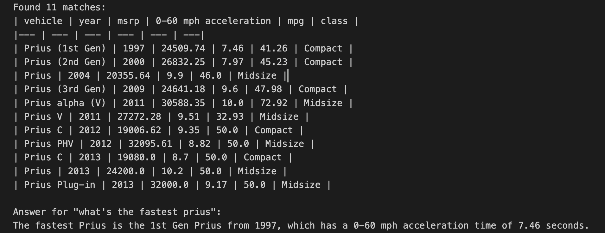

# Lesson 5: Talk to your data with Retrieval-Augmented Generation (RAG)

In this lesson, you will learn:
- The basics of Retrieval-Augmented Generation (RAG) and how it can be used to enhance the responses of generative AI models.
- How to integrate external data sources into your AI application.
- To leverage your data to improve the relevance and accuracy of the AI-generated content.

## Related resources

[](https://www.youtube.com/watch?v=xkFOmx5yxIA&list=PLlrxD0HtieHi5ZpsHULPLxm839IrhmeDk&index=4)

*🎥 Click on the image above to watch a short video about RAG*

- **Slides:** [pptx](../../videos/slides/03-rag.pptx) / [pdf](../../videos/slides/pdf/03-rag.pdf)

## Narrative - Genesis

The air was thick with the scent of incense and the distant hum of Aztec chants. The temple walls were adorned with intricate carvings depicting gods and warriors, their stories etched in stone. Leonardo da Vinci, with his ever-curious eyes, examined the carvings closely, tracing the lines with his fingers. "Incredibile, the craftsmanship is beyond anything I've seen," he murmured, his Italian accent adding a melodic lilt to his words.

You held the time beetle device, its surface warm and pulsating with a faint blue glow. The device felt almost alive in your hand, its energy resonating with the ancient surroundings. "Leonardo, it's time to go," you said, pressing the button. The device whirred to life, and a mechanical voice echoed, "It's time to go home, it's time for 'genesis'."

"Genesis? Che cosa significa?" Leonardo asked, his brow furrowing in confusion. Before you could respond, the world around you dissolved into a blur of colors and sounds, the temple fading away as you were pulled through time.


You land in garden, it's late at night with a thick fog and eerie lights are flickering in the distance. The mansion looms before you, its grandeur casting a shadow over the garden. Leonardo looked around, his eyes wide with wonder. "Mio Dio". 

Leonardo looked around, his eyes wide with wonder. "Mio Dio, this place is beautiful!"

### Running from the Dogs


Before you could take in more of the scenery, a low growl caught your attention. You turned to see a pack of large, imposing dogs bounding towards you, their teeth bared and eyes fixed on you. "Run!" you shouted, grabbing Leonardo's arm and sprinting towards the mansion.

The dogs were fast, their paws thudding against the ground as they closed the distance. You could hear their snarls growing louder, and your heart pounded in your chest. Just as you reached the mansion's door, it swung open, and a pair of servants rushed out.

The servants looked you up and down, their expressions a mix of curiosity and suspicion. Without a word, they gestured for you to follow them. You and Leonardo exchanged a quick glance before stepping inside. The interior was just as impressive as the garden, with ornate furnishings, intricate tapestries, and gleaming chandeliers. The air was filled with the scent of polished wood and fresh flowers.

The servants led you through the grand halls of the mansion, their footsteps echoing on the marble floors. You descended a spiral staircase, the stone steps cool under your feet, and entered a dimly lit basement. The air was damp and cool, carrying the faint scent of mildew. The only light came from a flickering candle in the distance, casting long shadows on the stone walls. The servants stopped in front of a heavy wooden door and knocked.


The door creaked open, revealing Ada Lovelace, her eyes sparkling with curiosity. "Ah, it's about time you arrived," she said, her voice warm and welcoming. "We need you to run an errand."

Charles Babbage stepped forward, examining the time beetle in your hand. His eyes lit up with fascination as he inspected the device. "This device is remarkable, but it's a bit faulty, isn't it? You've noticed, I'm sure."

Leonardo nodded, "Sì, it has been acting strangely."

Ada took the device, her fingers deftly inspecting it. "It's good for one more turn and return trip, but we need a missing part—gold. Without it, the device won't function properly."

She spoke into the device, "1324, Mansa Musa." You barely had time to react. "Wait, stop!" you shouted, but it was too late. The world spun around you once more, the basement dissolving into a whirl of colors and sounds.

### Mansa Musa

You found yourselves in the bustling streets of Timbuktu, the air filled with the scent of spices and the sound of merchants haggling. The marketplace was a riot of colors, with stalls overflowing with vibrant fabrics, exotic fruits, and shimmering jewelry. Leonardo looked around in awe. "Mio Dio, this place is magnificent!"

_To be continued..._

## Known Challenges with LLMs

Before we talk about the specifics of RAG, let's take a moment to discuss some of the known challenges with LLMs. These models are trained on huge amounts of text data and can generate responses that are contextually relevant and grammatically correct. However, just like any data that you can find on the internet, the information generated by LLMs can sometimes be inaccurate, incomplete, or misleading, because of multiple factors:

- **Out of date sources:** The data used to train the model may be outdated and no longer accurate.
- **Wrong or inaccurate information:** The sources used to train the model may contain incorrect or misleading information, like fake news or biased opinions.
- **Non-authoritative sources:** The model may not be able to distinguish between authoritative and non-authoritative sources in its training data, leading to unreliable information.

This makes it difficult to tell if an information generated by an LLM is correct or not. This is where RAG comes in.

## RAG Core Concepts

**Retrieval-Augmented generation** (RAG) is a powerful technique that combines the strengths of two different approaches in natural language processing: retrieval-based methods and generative models. This hybrid approach allows for the generation of responses that are both contextually relevant and rich in content, to help alleviate some of the known challenges with LLMs.

At its core, RAG involves two main components: a **retriever** and a **generator**.

- *The retriever:* it's responsible for finding relevant information from external data sources that can be used to enhance the AI-generated responses, like a search engine. This information can be in the form of text, images, or any other type of data that is relevant to the context of the conversation, although text is the most common type of data used.

- *The generator:* it takes the retrieved information and use it to generate a response that is contextually relevant and informative.

Here's a schema illustrating how a RAG system works:


1. **User input:** The user asks a question.
2. **Retriever:** The retriever component searches for relevant information using one or more knowledge bases.
3. **Augmented prompt:** The retrieved information is combined with the user question and context, to create an augmented prompt.
4. **Generator:** The LLM uses the augmented prompt to generate a response.

This combination allows for more precise and relevant answers, by using data that you provide instead of relying on the model’s training data.

## Integrating external data sources

Integrating external data sources into your AI application can be done in a variety of ways, depending on the type of data you want to use and the complexity of the retrieval mechanism. Here are a few common methods:

- **APIs:** Many external data sources provide APIs that allow you to access their data programmatically. You can use these APIs to retrieve information in real-time and use it to enhance the AI-generated responses.

- **Databases:** If you have a large amount of data that you want to use for retrieval, you can store it in a database and query it as needed. This can be useful for structured data that needs to be accessed quickly.

Once you've settled on a method for integrating external data sources, you may also need to consider how to preprocess and format the data so that it can be easily used by the AI model. This can involve cleaning the data, converting it to a suitable format (such as plain text or Markdown), or splitting it into smaller chunks for easier retrieval.

> [!NOTE]
> When integrating external data sources into your AI application, it's important to consider the privacy and security implications of accessing and storing data. Make sure you have the necessary permissions and safeguards in place to protect the data and comply with any relevant regulations.

If you're using a database, you also want to think how you want to *search your data* to retrieve the most relevant information. This can be done using keyword search, full-text search, or more advanced techniques like semantic search or vector search that may need specific indexing. We'll cover advanced search techniques in a future lesson.

## Augmenting the prompt

After you've implemented a way to retrieve information from your data sources, you can use this information to *augment the prompt* that you provide to the AI model. This can be done by adding the retrieved information to the input text that you pass to the model, along with additional context or instructions to help guide the generation process.

For example, if you're building an app to answer questions about cars, you could have a prompt like this:

```
## Instructions
Answer questions about cars using only the sources below.
If there's not enough data in provided sources, say that you don't know.
Be brief and straight to the point.

## Sources
<insert the retrieved information here>

## Question
<insert the question here>
```

By providing the AI model with additional context and information, you can help guide the generation process and ensure that the responses are accurate and relevant to the topic at hand.

> [!TIP]
> Note this part of the prompt: `If there's not enough data in provided sources, say that you don't know.`. This is important to avoid the AI generating incorrect information when there's not enough data to provide a reliable answer. This technique is called an *escape hatch* and is a good practice to ensure the quality of the generated content.

With this part it's becoming more obvious how RAG can also be considered as an advanced form of *prompt engineering*.

### Code Example

Let's now put this knowledge into practice by integrating a simple retrieval mechanism into a JavaScript application. We'll use a [CSV](https://fr.wikipedia.org/wiki/Comma-separated_values) file containing data about hybrid cars, and a simple search algorithm to find relevant information based on a user question.

```javascript
// This example demonstrates how to use the Retrieval Augmented Generation (RAG)
// to answer questions based on a hybrid car data set.
// The code below reads the CSV file, searches for matches to the user question,
// and then generates a response based on the information found.

import { fileURLToPath } from 'node:url';
import { dirname } from 'node:path';
import process from "node:process";
import fs from "node:fs";
import { OpenAI } from "openai";

// Change the current working directory to the directory of the script
const __dirname = dirname(fileURLToPath(import.meta.url));
process.chdir(__dirname);

// 1. Ask a question about hybrid cars
// -----------------------------------

const question = `what's the fastest prius`;

// 2. Retriever component: search the data for relevant information
// ----------------------------------------------------------------

// Load CSV data as an array of objects
const rows = fs.readFileSync("./hybrid.csv", "utf8").split("\n");
const columns = rows[0].split(",");

// Search the data using a very naive search
const words = question
  .toLowerCase()
  .replaceAll(/[.?!()'":,]/g, "")
  .split(" ")
  .filter((word) => word.length > 2);
const matches = rows.slice(1).filter((row) => words.some((word) => row.toLowerCase().includes(word)));

// Format as a markdown table, since language models understand markdown
const table =
  `| ${columns.join(" | ")} |\n` +
  `|${columns.map(() => "---").join(" | ")}|\n` +
  matches.map((row) => `| ${row.replaceAll(",", " | ")} |\n`).join("");

console.log(`Found ${matches.length} matches:`);
console.log(table);

// 3. Context augmentation: create a combined prompt with the search results
// --------------------------------------------------------------------------

const augmentedPrompt = `
## Instructions
Answer questions about hybrid cars using only the sources below.
If there's not enough data in provided sources, say that you don't know.
Be brief and straight to the point.

## Sources
${table}

## Question
${question}
`;

// 4. Generator component: use the search results to generate a response
// ---------------------------------------------------------------------

const openai = new OpenAI({
  baseURL: "https://models.inference.ai.azure.com",
  apiKey: process.env.GITHUB_TOKEN,
});

const chunks = await openai.chat.completions.create({
  model: "gpt-4o-mini",
  messages: [{ role: "user", content: augmentedPrompt }],
  stream: true,
});

console.log(`Answer for "${question}":`);

for await (const chunk of chunks) {
  process.stdout.write(chunk.choices[0].delta.content ?? "");
}
```

> [!IMPORTANT]
> Follow [the dev setup guide](../../docs/dev-setup.md) to see how to setup your environment to run this code.

You can find this code in the `example/rag-cars.js` file along with the `hybrid.csv` file containing the data used for the retrieval.

Once you run this code, you should see the data found by in the CSV file by the retriever, formatted as a markdown table, followed by the AI-generated response to the question. Try changing the question to see how the retrieved data and response changes. You can also try asking questions about unrelated topics to see how the AI model handles them.



## Assignment

As you lean closer to the device being worked on by Ada Lovelace, you notice a faint glow emanating from its core. The device is small and looks familiar, time beetle, do you know what this is?

Beetle: of course, it's me, or well it will be. Im missing a few parts though. Come to think of it, I'm missing a lot of parts, I don't even have a shell yet.

Ada: The time beetle is a device that allows you to travel through time and space, that is once we get it to work properly. For now, we need to add a new feature to it, a retrieval-augmented generation (RAG) module. This will help us retrieve information and needed context from different time periods as you're traveling.
You: Ok, fine I'll help, or it seems I've already helped as I'm here using a functioning version of the device. What do you need me to do?

We want to make sure we refer to all sorts of sources, Wikipedia is a good start.

Here's an example code that retrieves text information about Tim Berners-Lee from Wikipedia:

```javascript
const response = await fetch('https://en.wikipedia.org/w/api.php?format=json&action=query&prop=extracts&redirects=true&explaintext&titles=Tim%20Berners-Lee');
const data = await response.json();
const text = Object.values(data.query.pages)[0]?.extract;
```

## Solution

[Solution](./solution/rag-www.js)

## Knowledge Check

**Question**: What is the role of the retriever in a RAG system?

- [ ] A. The retriever generates responses based on the input data.
- [ ] B. The retriever generates relevant information based on the model's training data.
- [ ] C. The retriever finds relevant information from external data sources.

<!-- Answer: C  -->

## Self-Study Resources

- **Learn docs:** [Retrieval-Augmented Generation and Indexes](https://learn.microsoft.com/azure/ai-studio/concepts/retrieval-augmented-generation)
- **Sample apps**:
  * [Serverless AI Chat with RAG](https://github.com/Azure-Samples/serverless-chat-langchainjs/)
  * [Ask Youtube: A RAG-based Youtube Q&A API](https://github.com/Azure-Samples/langchainjs-quickstart-demo)
- **Full length workshop:** [Create your own ChatGPT with RAG](https://moaw.dev/workshop/gh:azure-samples/azure-openai-rag-workshop/docs/workshop-qdrant.md)
