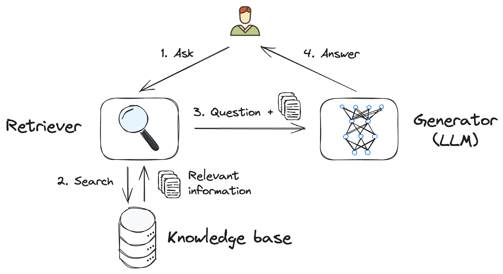

# 第5课：使用检索增强生成（RAG）与您的数据对话

在本章中，您将学习：

- 检索增强生成（RAG）的基础知识以及如何使用它来增强生成式AI模型的响应。
- 如何将外部数据源集成到您的AI应用程序中。
- 如何利用您的数据来提高AI生成内容的相关性和准确性。

## 设置

如果您尚未设置开发环境，请按照以下方法进行设置：[设置您的环境](/docs/setup/README.md)。

## 相关资源

[](https://www.youtube.com/watch?v=xkFOmx5yxIA&list=PLlrxD0HtieHi5ZpsHULPLxm839IrhmeDk&index=4)

_这个视频解释了检索增强生成（RAG），这是一种帮助AI在其训练数据之外使用您的内容以获得改进结果的方法。_

*🎥 点击上方图片观看关于检索增强生成（RAG）的短视频*

💼 幻灯片：[检索增强生成，RAG](../../../videos/slides/03-rag.pptx)

## 故事情节 - 起源

> [!NOTE] 
> _我们的故事到目前为止：您是一位来自19世纪60年代伦敦的机械师。您正在研究您的自动机，收到了查尔斯·巴贝奇的一封信，最终带您来到一个图书馆，在那里您拿起了一个时间旅行装置。在时间旅行中，您来到了佛罗伦萨，在那里遇见了达芬奇。您还去了阿兹特克帝国，故事就从这里继续。_
>
> 如果您想从头开始了解故事，请参阅[第1课](../01-intro-to-genai/README.md)。

> [!NOTE] 
> 虽然我们建议您阅读故事（很有趣！），但如果您想直接跳到技术内容，[请点击这里](#interact-with-ada-lovelace)。

**您**："达芬奇，是时候走了，"您按下按钮说道。设备嗡嗡作响，一个机械声音回响着，"是时候回家了，是时候'创世纪'了。"

**达芬奇**："创世纪？Che cosa significa？"达芬奇困惑地问道。在您回答之前，世界溶解成一片色彩和声音的模糊，神庙消失了，您被拉入时间之中。

您降落在花园里，现在是深夜，浓雾弥漫，远处闪烁着诡异的灯光。豪宅耸立在您面前。达芬奇环顾四周，眼中充满惊奇。

<div>
  
</div>

### 逃离猎犬

您听到吠叫声和狗向您奔来的声音。您转向达芬奇，"我们需要进去，现在！"

<div>
  
</div>

当您到达豪宅的门口时，门突然打开，一对侍者匆忙走出来。在打量了您之后，他们示意您跟随他们。

您与艾达·洛夫莱斯面对面，她的眼睛闪烁着好奇的光芒。

### 会见艾达和查尔斯

**艾达**："啊，你们终于来了，"她热情地说。"我们需要你们去办一件事。"

**您**："终于"，你们一直这么说。迪诺克拉底也说过同样的话，但我不确定你们是什么意思？

**艾达**：嘘，现在没时间说这个，我们需要谈谈你手中的设备。查尔斯，告诉他们...

**您**：但是...

<div>
  
</div>

查尔斯·巴贝奇走上前来，检查您手中的时间甲虫。"这个设备非常了不起，但它有点故障，不是吗？我想你已经注意到了。"

达芬奇点点头，"是的，它一直表现得很奇怪。"

**艾达**：这个设备还不完全准备好，我们需要给它更多的功能。我们需要让它更聪明，更了解周围的世界。我们的想法是让它能够从不同的时间段检索信息，并用它来生成准确和相关的响应。你能帮忙吗？

**您**：当然，听起来我们需要用数据来_增强_设备的响应，这很有道理。

**艾达**：让我们谈谈一个我想称之为RAG的概念，即检索增强生成。

## 与艾达·洛夫莱斯互动

如果您想与艾达互动，请运行[角色](/app/README.md)应用程序。

> [!IMPORTANT]
> 这完全是虚构的；响应由AI生成。
> [负责任的AI免责声明](/README.md#responsible-ai-disclaimer)

<div>
  
</div>

**步骤**：

1. 启动一个[](https://codespaces.new/microsoft/generative-ai-with-javascript)
2. 导航到仓库根目录中的_/app_。
3. 找到控制台并运行`npm install`，然后运行`npm start`。
4. 出现后，选择"在浏览器中打开"按钮。
5. 与艾达聊天。

有关应用程序的更详细说明，请参见[详细应用程序说明](/lessons/01-intro-to-genai/README.md#interact-with-dinocrates)。

> [!NOTE]
 > 如果您在本地机器上运行项目，请查看快速入门指南，设置[GitHub个人访问令牌](../../../docs/setup/README.md#creating-a-personal-access-token-pat-for-github-model-access)并在代码中替换密钥。

## 大型语言模型（LLM）的已知挑战

**艾达**：让我们先讨论我们将用来驱动设备的AI。我们将依靠"AI模型"搭配数据检索系统来提升响应质量。

在深入了解RAG细节之前，您需要解决一些挑战。这些模型经过大量文本数据训练，能够产生相关且正确的响应。但是，像任何数据源一样，由于各种因素，它们的输出可能不准确、不完整或具有误导性。

- **过时的来源**：用于训练模型的数据可能已经过时，不再准确。
- **错误或不准确的信息**：用于训练模型的来源可能包含不正确或误导性信息，如假新闻或有偏见的观点。
- **非权威来源**：模型可能无法区分其训练数据中的权威和非权威来源，导致信息不可靠。

这使得很难判断LLM生成的信息是否正确。这就是RAG的用武之地。

**您**：所以我需要确保设备能提供准确的信息，即使它对答案不确定？

**艾达**：是的，这就是我们的想法。通过结合检索方法和生成模型的优势，我们可以获得更好的AI系统。

## 检索增强生成（RAG）核心概念

**艾达**：好的，现在让我们具体讨论RAG。让我们从一些基础知识开始：

检索增强生成（RAG）是一种强大的技术，它结合了自然语言处理中两种不同方法的优势：基于检索的方法和生成模型。这种混合方法允许生成既与上下文相关又内容丰富的响应，有助于缓解LLM的一些已知挑战。

在其核心，RAG涉及两个主要组件**：检索器**和**生成器**。

- **检索器**：负责从外部数据源中查找可用于增强AI生成响应的相关信息，类似于搜索引擎。这些信息可以是文本、图像或任何其他与对话上下文相关的数据类型，尽管文本是最常用的数据类型。

- **生成器**：接收检索到的信息并使用它生成与上下文相关且信息丰富的响应。

以下是说明RAG系统如何工作的示意图：



1. **用户输入**：用户提出问题。
2. **检索器**：检索器组件使用一个或多个知识库搜索相关信息。
3. **增强提示**：检索到的信息与用户问题和上下文结合，创建增强提示。
4. **生成器**：LLM使用增强提示生成响应。

这种组合允许通过使用您提供的数据而不是依赖模型的训练数据，提供更精确和相关的答案。

**艾达**：有问题吗？

**您**：所以检索器找到信息，生成器使用它来生成响应？

**艾达**：没错，你已经掌握了要领。

## 集成外部数据源

**艾达**：现在我们已经介绍了RAG的基础知识，让我们谈谈如何将外部数据源集成到您的AI应用程序中。

将外部数据源集成到您的AI应用程序中可以通过多种方式完成，这取决于您想要使用的数据类型和检索机制的复杂性。以下是一些常见方法：

- **API**：许多外部数据源提供API，允许您以编程方式访问其数据。您可以使用这些API实时检索信息，并用它来增强AI生成的响应。

- **数据库**：如果您有大量想要用于检索的数据，可以将其存储在数据库中并根据需要查询。这对于需要快速访问的结构化数据很有用。

一旦您确定了集成外部数据源的方法，您可能还需要考虑如何预处理和格式化数据，使其能够被AI模型轻松使用。这可能涉及清理数据，将其转换为合适的格式（如纯文本或Markdown），或将其分割成更小的块以便更容易检索。

> [!NOTE]
> 在将外部数据源集成到您的AI应用程序时，考虑访问和存储数据的隐私和安全影响很重要。确保您有必要的权限和保障措施来保护数据并遵守任何相关法规。

如果您使用数据库，您还需要考虑如何*搜索您的数据*以检索最相关的信息。这可以通过关键词搜索、全文搜索或更高级的技术如语义搜索或向量搜索来完成，这些可能需要特定的索引。我们将在未来的课程中介绍高级搜索技术。

**您**：您能用更符合19世纪60年代的术语解释API和数据库吗？

**艾达**：当然，API就像是一个从一个地方传递消息到另一个地方的信使，而数据库就像是一个存放所有书籍的图书馆。

**您**：啊，我明白了，这很有道理。

## 增强提示

**艾达**：你还跟得上吗？很好，让我们进入下一步，尝试改进发送给AI模型的提示。

**艾达**：一旦您设置了从数据中提取信息的方式，您可以将其添加到AI模型的提示中。只需将检索到的信息与输入文本混合，并添加一些额外的上下文或指导来引导AI的响应。

例如，如果您正在构建一个回答关于汽车问题的应用程序，您可以使用如下提示：

```text

## 指令
仅使用以下来源回答关于汽车的问题。
如果提供的来源中没有足够的数据，请说明您不知道。
简明扼要地回答。

## 来源
<在此插入检索到的信息>

## 问题
<在此插入问题>
```

通过为AI模型提供额外的上下文和信息，您可以帮助引导生成过程，确保响应准确且与主题相关。

> [!TIP]
> 注意提示中的这部分：`如果提供的来源中没有足够的数据，请说明您不知道。`。这对于避免AI在没有足够数据提供可靠答案时生成不正确信息很重要。这种技术被称为*逃生舱*，是确保生成内容质量的良好实践。

RAG可以被视为*提示工程*的高级形式。

### 代码示例

**艾达**：实践出真知，所以让我们应用我们所学的知识来看一个例子。我们将使用混合汽车数据的[CSV](https://fr.wikipedia.org/wiki/Comma-separated_values)文件和一个基本搜索算法，根据用户问题提取相关信息，构建一个简单的检索系统到JavaScript应用程序中。

```javascript
// 这个例子演示了如何使用检索增强生成（RAG）
// 基于混合汽车数据集回答问题。
// 下面的代码读取CSV文件，搜索与用户问题匹配的内容，
// 然后根据找到的信息生成响应。

import { fileURLToPath } from 'node:url';
import { dirname } from 'node:path';
import process from "node:process";
import fs from "node:fs";
import { OpenAI } from "openai";

// 将当前工作目录更改为脚本所在的目录
const __dirname = dirname(fileURLToPath(import.meta.url));
process.chdir(__dirname);

// 1. 提出关于混合动力汽车的问题
// -----------------------------------

const question = `什么是最快的普锐斯`;

// 2. 检索器组件：在数据中搜索相关信息
// ----------------------------------------------------------------

// 将CSV数据加载为对象数组
const rows = fs.readFileSync("./hybrid.csv", "utf8").split("\n");
const columns = rows[0].split(",");

// 使用非常简单的搜索方法搜索数据
const words = question
  .toLowerCase()
  .replaceAll(/[.?!()'":,]/g, "")
  .split(" ")
  .filter((word) => word.length > 2);
const matches = rows.slice(1).filter((row) => words.some((word) => row.toLowerCase().includes(word)));

// 格式化为markdown表格，因为语言模型理解markdown
const table =
  `| ${columns.join(" | ")} |\n` +
  `|${columns.map(() => "---").join(" | ")}|\n` +
  matches.map((row) => `| ${row.replaceAll(",", " | ")} |\n`).join("");

console.log(`找到 ${matches.length} 个匹配项:`);
console.log(table);

// 3. 上下文增强：创建包含搜索结果的组合提示
// --------------------------------------------------------------------------

const augmentedPrompt = `
## 指令
仅使用以下来源回答关于时间段或该时间段人物的问题。
如果提供的来源中没有足够的数据，请说明您不知道。
简明扼要地回答。

## 来源
${table}

## 问题
${question}
`;

// 4. 生成器组件：使用搜索结果生成响应
// ---------------------------------------------------------------------

const openai = new OpenAI({
  baseURL: "https://models.inference.ai.azure.com",
  apiKey: process.env.GITHUB_TOKEN,
});

const chunks = await openai.chat.completions.create({
  model: "gpt-4o-mini",
  messages: [{ role: "user", content: augmentedPrompt }],
  stream: true,
});

console.log(`"${question}"的答案:`);

for await (const chunk of chunks) {
  process.stdout.write(chunk.choices[0].delta.content ?? "");
}
```

您可以在[`example/rag-cars.js`](../example/rag-cars.js)文件中找到此代码，以及包含用于检索的数据的[`hybrid.csv`](../example/hybrid.csv)文件。

**艾达**：运行此代码后，您应该会看到检索器在CSV文件中找到的数据，格式化为markdown表格，然后是AI生成的对问题的响应。尝试更改问题，看看检索到的数据和响应如何变化。您还可以尝试询问不相关的主题，看看AI模型如何处理它们。

```text
输出示例：

找到1个匹配项：
| 人物 | 时间段 | 描述 |
|---|---|---|
| 达芬奇 | 15世纪 | 意大利多才多艺的人，以其艺术和发明而闻名。 |
| 艾萨克·牛顿 | 17世纪 | 英国数学家和物理学家，提出了运动定律和万有引力定律。 |
```

**您**：这太棒了，我可以看到这在使用设备时会很有用，或者说它已经有用了，或者将来会有用，时间旅行真令人困惑*叹气*。

**艾达**：别担心，你做得很好。让我们继续下一步。

## 作业 - 帮助艾达和查尔斯

学习了RAG之后，您现在已经准备好帮助艾达和查尔斯完善他们的设备了。然而，仔细检查后，这个设备看起来很熟悉。

**您**：时间甲虫，你知道这是什么吗？

**时间甲虫**：当然，这就是我，或者说将来会是我。我缺少一些部件，实际上，我缺少很多部件，我甚至还没有外壳。

**艾达**：时间甲虫是一个允许您穿越时间和空间的设备，一旦我们让它正常工作。正如我所说，我们需要为它添加一个新功能，一个检索增强生成（RAG）模块。这将帮助我们在您旅行时从不同的时间段检索信息和所需的上下文。我们想确保我们参考各种来源，维基百科是一个很好的起点。

**您**：您需要我做什么？

**艾达**：这里有一个示例代码，它从维基百科检索关于蒂姆·伯纳斯-李的文本信息，蒂姆将来会非常重要。

```javascript
const response = await fetch('https://en.wikipedia.org/w/api.php?format=json&action=query&prop=extracts&redirects=true&explaintext&titles=Tim%20Berners-Lee');
const data = await response.json();
const text = Object.values(data.query.pages)[0]?.extract;
```

**您**：我想我不是唯一一个去过未来的人？

**艾达**：...

## 解决方案

[解决方案](../solution/rag-www.js)

## 知识检查

**问题**：在RAG系统中，检索器的角色是什么？

A. 检索器根据输入数据生成响应。

B. 检索器根据模型的训练数据生成相关信息。

C. 检索器从外部数据源中查找相关信息。

[测验解决方案](../solution/solution-quiz.md)

## 自学资源

- [检索增强生成和索引](https://learn.microsoft.com/azure/ai-studio/concepts/retrieval-augmented-generation)
- **示例应用**：
  * [使用RAG的无服务器AI聊天](https://github.com/Azure-Samples/serverless-chat-langchainjs/)
  * [Ask Youtube：基于RAG的Youtube问答API](https://github.com/Azure-Samples/langchainjs-quickstart-demo)
- [完整工作坊：使用RAG创建您自己的ChatGPT](https://moaw.dev/workshop/gh:azure-samples/azure-openai-rag-workshop/docs/workshop-qdrant.md)

**艾达**：让我们先讨论我们将用来驱动设备的AI。我们将依靠"AI模型
